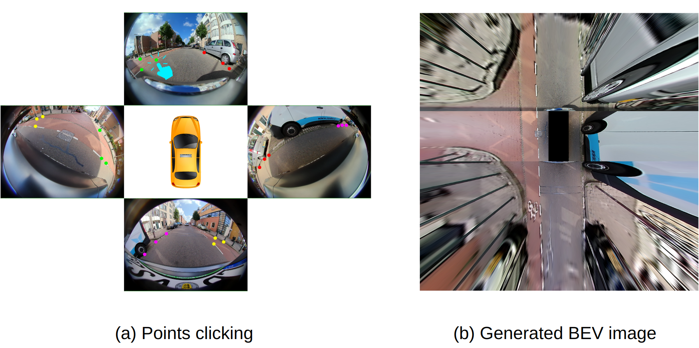

# Click-Calib: A Robust Extrinsic Calibration Method for Surround-View Systems

This is the official code repository for our paper Click-Calib. The example data (images & calibrations) are from the public dataset [WoodScape](https://github.com/valeoai/WoodScape).

[[Paper](https://arxiv.org/abs/2501.01557)] [[Video](https://www.youtube.com/watch?v=p4pmqPD5JJU)]

### Overview


## Python environment setup

Click-Calib requires Python 3.7 or later. Run the following command in your terminal to install the required packages:

`pip install -r requirements.txt`

## Usage Guide

### Step 1: Initialize extrinsic calibration

To ensure the optimization convergence, an initial guess of the Surround-View System (SVS) extrinsic calibration needs to 
be provided. In this demo we use the original calibration from WoodScape as the initial values for simplicity. However, 
you can also use the script initialize_extrins_calib.py to get the initial values via manually adjusting each camera's pose.

### Step 2: Select keypoints

Use the click_points.py script to click keypoints in each pair of adjacent camera images. Ensure both images have an equal 
number of selected keypoints. After you finish clicking, simply close the GUI window; the selected keypoints will then be 
printed out. To achieve good calibration, at least 10 points need be selected for each pair of adjacent cameras. If you 
prefer not to select points yourself, you can skip this step and use our pre-selected keypoints provided in optimize.py.

### Step 3: Optimize

Copy and paste the keypoints from click_points.py to optimize.py, then run optimize.py. The optimization process should 
take about 5 to 30 seconds. If it takes too long time or results in a large Mean Distance Error (MDE), this indicates 
a failure to converge. In such cases, check your initial extrinsics or other settings (e.g., number of selected keypoints).

### (Optional) Step 4: Generate BEV images

For qualitative evaluation, use generate_bev_img.py to create BEV images from SVS images. It overlays all pixels 
reprojected from each camera, so better calibration will yield better alignment while poor calibration will have more 
"ghosting" effect.

### (Optional) Step 5: Metric calculation

For quantitative evaluation, use eval.py to compute the MDE metric on your test frames.

### Acknowledgements

The implementation of Click-Calib is based on [WoodScape](https://github.com/valeoai/WoodScape), and we extend our 
gratitude to all its contributors.

## Citation
If you find Click-Calib is useful in your research or applications, please consider giving us a star 🌟 and citing:

**Click-Calib: A Robust Extrinsic Calibration Method for Surround-View Systems**.
[Lihao Wang](https://scholar.google.com/citations?user=u2NnHowAAAAJ&hl=en). In arXiv:2501.01557.

Bibtex:
```
@inproceedings{lwang2025clickcalib,
  title={Click-Calib: A Robust Extrinsic Calibration Method for Surround-View Systems},
  author={Lihao Wang},
  booktitle={arXiv:2501.01557},
  year={2025}
}
```